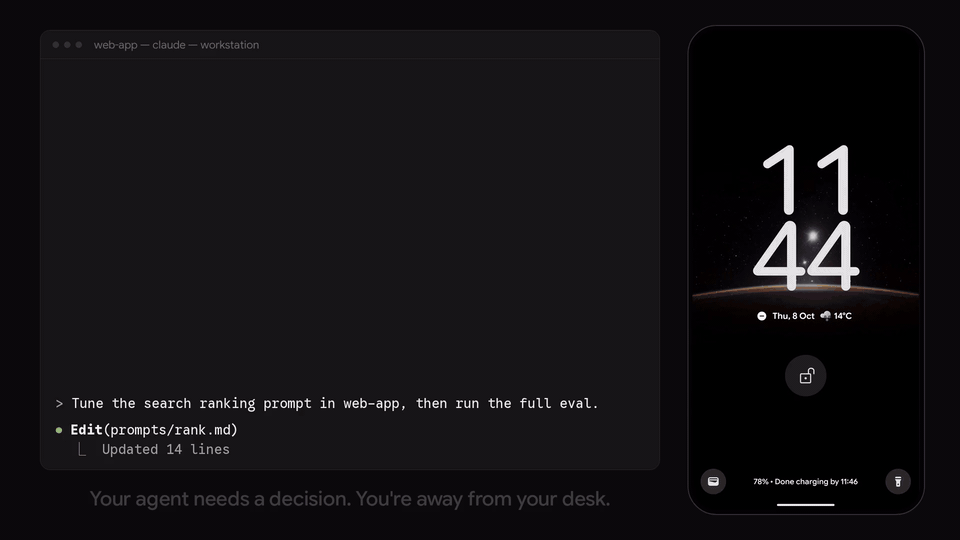

# Starbridge

Know the moment your agent is stuck.

When a coding agent stops for a question, Starbridge puts it on your phone and in your browser.
You answer with one tap, and the waiting session carries on with your answer as its next prompt.
Claude Code, Codex, Pi and opencode on every machine reach you in one place. An agent also stops
when its quota runs out, so Starbridge shows what's left on each AI plan, read from CodexBar, with
an optional alert before a window runs out. CodexBar is optional: setup asks before installing it,
and `--no-quota` skips it. You also follow the runs that affect you, such as an eval on a rented
GPU or a release, and can answer permission prompts from your phone once you turn them on.

Your phone, browsers and machines encrypt everything they send each other, so the server stores
your content only as ciphertext; it still sees who sent each item, to which
devices, its kind, size and times.
[What the server sees](https://starbridge.run/docs/faq#what-does-the-server-see) has the details
and the limits. Use the free server at [starbridge.run](https://starbridge.run), or host your own.



Launch week: [known issues](https://github.com/T0mSIlver/starbridge/issues?q=is%3Aissue%20label%3Aknown-issue).

## Get the app

- **Android:** the signed APK from [GitHub Releases](https://github.com/T0mSIlver/starbridge/releases),
  or add the repository to [Obtainium](https://apps.obtainium.imranr.dev/redirect?r=obtainium://add/https://github.com/T0mSIlver/starbridge)
  to get updates. The APK is signed with the same key as the Google Play build, so a Play install
  later updates it in place.
- **Google Play:** in closed testing, and looking for testers. Join
  [the group](https://groups.google.com/g/starbridge-testers), then
  [opt in](https://play.google.com/apps/testing/dev.starbridge.app).
- **iOS:** add [starbridge.run](https://starbridge.run) to the Home Screen from Safari to get
  notifications, on iOS 16.4 and later. A native app is planned.
- **Any browser:** [starbridge.run](https://starbridge.run).

## Install the CLI

Sign in at [starbridge.run](https://starbridge.run) or in the Android app, then install the CLI
on each machine that runs agents:

```bash
curl -fsSL https://starbridge.run/install.sh | sh
```

On Windows, in PowerShell:

```powershell
irm https://starbridge.run/install.ps1 | iex
```

Or with Homebrew:

```bash
brew install T0mSIlver/starbridge/starbridge
```

Or with npm:

```bash
npm install -g starbridge
```

The script runs `starbridge setup`, which pairs the machine, installs Starbridge in each agent it
finds and ends by offering to send a test question to your devices. After Homebrew or npm, run
`starbridge setup` yourself. [Start](https://starbridge.run/docs#start) goes on to your agent's
first question.
[One notification per question](https://starbridge.run/docs/notifications) turns off your
agents' own notifications for what Starbridge already sends.

## What each agent supports

| | Claude Code | Codex | Pi | opencode |
|---|---|---|---|---|
| Questions | ✓ | ✓ | ✓ | ✓ |
| Answers into the live session | ✓ | ✓ | ✓ | ✓ |
| "Waiting for you" | ✓ | ✓ | ✓ | ✓ |
| Runs | ✓ | ✓ | ✓ | ✓ |
| Permission prompts | Opt-in | No | Opt-in | Opt-in |
| The agent's own ask tool | ✓ | n/a | n/a | ✓ |
| Rules for when to ask you | ✓ | ✓ | ✓ | ✓ |

In Claude Code, the answer arrives through a [Claude Code mod](https://code.claude.com/docs/en/plugins/mods/overview), code that
runs inside Claude Code: it submits your answer into the live session as its next prompt. Setup
installs it beside the Starbridge plugin.

Answers go into interactive sessions; Claude Code needs 2.1.287 or later, Codex CLI 0.160 or later. In `codex exec`, `pi -p` and
`opencode run`, the agent waits for the answer with `starbridge wait` instead.

[What each agent supports](https://starbridge.run/docs/tell-your-agents#what-each-agent-supports)
lists the version and setup each one needs.

Tested for 0.1.0: Claude Code on macOS, Linux and Windows 11; Codex, opencode and Pi on Linux.

## Docs

[starbridge.run/docs](https://starbridge.run/docs): getting started, the CLI, telling your agents
when to reach you, self-hosting, and the [FAQ](https://starbridge.run/docs/faq), with what the
server can and can't see.

## Contributing

See [CONTRIBUTING.md](CONTRIBUTING.md). Report vulnerabilities privately: [SECURITY.md](SECURITY.md).

## Licence

[MIT](LICENSE)
