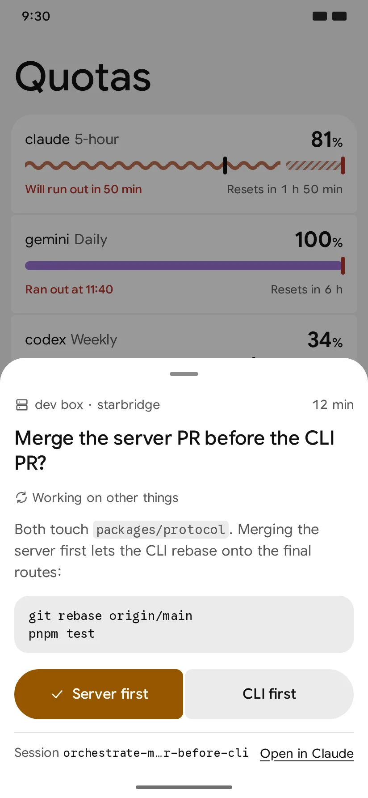

# Starbridge docs

Starbridge is where you supervise your coding agents from your phone or a browser. When an agent
needs a decision from you, you answer with one tap and the answer goes back into the session
that asked. You also follow the runs that affect you, such as a release or heavy work on your
machine.

Your phone, browsers and machines encrypt everything they send each other, so the server stores
your content only as ciphertext; it still sees who sent what to which device, and when.
[What the server sees](faq.md#what-does-the-server-see) has the details and the limits. Use the
free server at starbridge.run, or [host your own](../server/README.md).

## Start

1. **Get the app and sign in.** On Android, install the APK from
   [GitHub Releases](https://github.com/T0mSIlver/starbridge/releases); anywhere else, open
   [starbridge.run](https://starbridge.run). Sign in with GitHub. The first device you sign in on
   creates your account's keys and shows your [recovery key](#recovery-key) once: save it. A
   server that turned hostile could read a browser's keys through the page it sends, so to keep
   them from the server, start in the Android app and add no browser
   ([FAQ](faq.md#what-does-the-server-see)).

2. **Install the CLI** on each machine that runs agents:

   ```bash
   curl -fsSL https://starbridge.run/install.sh | sh
   ```

   On Windows, in PowerShell: `irm https://starbridge.run/install.ps1 | iex`.

   The script then runs `starbridge setup`. Homebrew and npm work too; see
   [The CLI](../cli/README.md#install).

3. **Pair the machine.** Setup prints a code, a link and a QR code. Scan the QR code with your
   phone, open the link in a browser where you are signed in, or, on a machine with no browser,
   type the code in Settings → Devices → Add a device on your phone. The code expires in 10
   minutes. Setup then installs the background service, and asks before it uploads your AI plans'
   quotas, before it installs Starbridge in each agent it finds, and whether to send permission
   prompts to your devices. The quotas need CodexBar, which setup installs; with no AI plan,
   `--no-quota` skips both.

4. **Answer the test question.** Setup ends with "Send a test decision to your phone?". Say yes,
   and your phone asks "Does Starbridge reach you from" this machine. Tap Yes, and the terminal
   prints your answer. If nothing arrives, `starbridge status` checks the machine's side. To send
   one again later:

   ```bash
   starbridge ask --question "Does this reach my phone?" --option Yes --option No --wait
   ```

5. **Ask from an agent.** Start a new Claude Code, Pi or opencode session, or
   [resume a running one](#sessions-already-running). Type:

   ```
   Ask me through Starbridge whether to name the branch "fix" or "patch", then create it.
   ```

   The question reaches your phone with the two names as buttons. Your tap comes back into the
   session as its next prompt, and the agent goes on. In Codex (CLI 0.160 or later), the answer reaches
   interactive sessions while the background service runs.



Then tell your agents when to reach you. With the plugin, Claude Code asks you for decisions that
are yours and reports the commands that block you. Pi and opencode get the same rules from their
Starbridge package and plugin. Codex gets the skill only, so paste the
[rules for Codex](tell-your-agents.md#rules-for-codex) into its instructions.
[Agent instructions](tell-your-agents.md) covers each agent and how to add your own rules.

## Sessions already running

A session that was running when you installed Starbridge doesn't have it: each agent loads its
plugins, skills and instructions when it starts. Quit the agent and resume the session, which
keeps its conversation:

| Agent | Resume the last session | Pick one |
|---|---|---|
| Claude Code | `claude --continue` | `claude --resume` |
| Codex | `codex resume --last` | `codex resume` |
| Pi | `pi --continue` | `pi --resume` |
| opencode | `opencode --continue` | `opencode --session <id>` |

Run the command in the session's own directory, since the last session is per directory.

## What you get

- **Questions.** An agent asks with two to four options, and code, images or links when they
  help you decide. Your tap reaches its session as the next prompt.
- **Runs.** A build, a release, an eval or heavy work on your machine shows its progress on your
  devices until it passes or fails.
- **Quotas.** What's left on each AI plan, read from
  [CodexBar](https://github.com/steipete/CodexBar), with an optional alert before a window runs
  out.
- **Permission prompts.** Allow or deny, from your phone, the calls Claude Code, opencode and Pi
  ask permission for. Off until you turn them on.

Starbridge works with Claude Code, Codex, Pi and opencode.
[Agent instructions](tell-your-agents.md#what-each-agent-supports) lists what each one supports.

## Recovery key

The recovery key adds a new device to your account when you have lost every device. The first
device you sign in on shows it once. Store it somewhere safe, away from your devices, such as a
password manager or paper. Replacing the key needs the current one, so a lost key is gone for good,
but you keep using the devices you have.

To replace the key, pick Replace next to Recovery key: on the web under Settings → Devices, in the
app under Settings → Devices and machines. Replacing asks for the current key, and the old key
stops working.

To recover, sign in on a new phone or browser and pick "Use the recovery key". Recovering removes
every other device and machine from the account. Add your phones and browsers again from
Settings → Devices → Add a device, and pair each machine again:

```bash
starbridge pair --force
```
